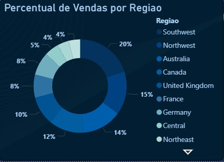
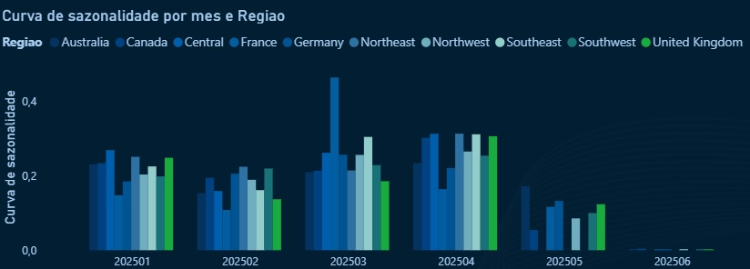

# ✏️ Criação de metas - Estudo de caso

Este documento tem por objetivo demonstrar uma situação real de criação de metas de faturamento visando um crescimento organico com base em estudo geográfico utilizando o banco de dados AdventureWorks para exemplificar.

Você pode encontrar esse banco de dados através do link:
https://learn.microsoft.com/pt-br/sql/samples/adventureworks-install-configure?view=sql-server-ver17&tabs=ssms

## 📌 Solução

### 1. Identificar o percentual de faturamento em que cada região representou no ano anterior

````sql
;with faturamento as (
    select
        sum(subtotal)                                                   as Faturamento
    from sales.salesorderheader
    where
        orderdate between datefromparts(year(getdate()) - 1, 1, 1) and datefromparts(year(getdate()) - 1, 12, 31)
)
select
    a.territoryid                                                       as TerritoryId,
    b.name                                                              as Regiao,
    sum(subtotal)                                                       as TotalVendas,
    round(sum(subtotal) / (select faturamento from faturamento), 2)     as PercentualVendas
from sales.salesorderheader a
join sales.salesterritory b on a.territoryid = b.territoryid
where
    orderdate between datefromparts(year(getdate()) - 1, 1, 1) and datefromparts(year(getdate()) - 1, 12, 31)
group by
    a.territoryid,
    b.name
order by 1
````
**Resultado esperado:**




### 2. Identificar a curva de sazonalidade para compreender quais são os meses com maior e menor movimento de faturamento por região

````sql
select
    a.territoryid                                                       as territoryid,
    b.name                                                              as regiao,
    format(orderdate, 'yyyyMM')                                         as mes,
    sum(subtotal)                                                       as totalvendas,
    
    -- cálculo da curva de sazonalidade:
    -- divide o total do mês pelo total acumulado daquela região específica no ano
    round(
        sum(subtotal) / sum(sum(subtotal)) over(partition by a.territoryid), 
    4)                                                                  as curva_sazonalidade

from sales.salesorderheader a
join sales.salesterritory b on a.territoryid = b.territoryid
where
    orderdate between datefromparts(year(getdate()) - 1, 1, 1) and datefromparts(year(getdate()) - 1, 12, 31)
group by
    a.territoryid,
    b.name,
    format(orderdate, 'yyyyMM')
order by 1, 3
````
**Resultado esperado:**



### 3. Realizar um estudo para compreender o percentual de crescimento/decrescimento dos últimos 5 anos

````sql
;with vendas_anuais as (
    select
        grouping(b.name)                                                 as total,
        a.territoryid,
        isnull(b.name, 'Total Geral')                                    as regiao,
        year(a.orderdate)                                                as ano,
        sum(a.subtotal)                                                  as faturamento_atual
    from sales.salesorderheader a
    join sales.salesterritory b on a.territoryid = b.territoryid
    where 
        year(a.orderdate) >= year(getdate()) - 5
    group by rollup (year(a.orderdate), (a.territoryid, b.name))
    having year(a.orderdate) is not null
),
comparativo_yoy as (
    select
        total,
        territoryid,
        regiao,
        ano,
        faturamento_atual,
        lag(faturamento_atual) over (partition by regiao order by ano)   as faturamento_anterior
    from vendas_anuais
)
select
    regiao,
    ano,
    format(faturamento_atual, 'c', 'pt-br')                              as faturamento_atual,
    format(faturamento_anterior, 'c', 'pt-br')                           as faturamento_anterior,
    round(
        ((faturamento_atual - faturamento_anterior) / nullif(faturamento_anterior, 0)) * 100, 
    2)                                                                   as perc_crescimento_yoy
from comparativo_yoy
where ano is not null
order by total,regiao, ano desc;
````
**Resultado esperado:**

| regiao | ano | faturamento_atual | faturamento_anterior | perc_crescimento_yoy D
|---|---|---|---|---|
| Australia | 2025 | R$ 2.751.945,92 | R$ 4.246.450,55 | -35,19 |
| Australia | 2024 | R$ 4.246.450,55 | R$ 2.114.048,37 | 100,86 |
| Australia | 2023 | R$ 2.114.048,37 | R$ 1.542.891,12 | 37,01 |
| Australia | 2022 | R$ 1.542.891,12 | NULL | NULL |
| Canada | 2025 | R$ 2.389.120,60 | R$ 6.231.209,96 | -61,65 |
| Canada | 2024 | R$ 6.231.209,96 | R$ 5.580.848,05 | 11,65 |
| Canada | 2023 | R$ 5.580.848,05 | R$ 2.154.591,84 | 159,02 |
| Canada | 2022 | R$ 2.154.591,84 | NULL | NULL |
| Central | 2025 | R$ 955.864,73 | R$ 2.994.225,38 | -68,07 |
| Central | 2024 | R$ 2.994.225,38 | R$ 2.758.256,66 | 8,55 |
| Central | 2023 | R$ 2.758.256,66 | R$ 1.200.662,23 | 129,72 |
| Central | 2022 | R$ 1.200.662,23 | NULL | NULL |
| France | 2025 | R$ 1.664.041,62 | R$ 3.816.543,33 | -56,39 |
| France | 2024 | R$ 3.816.543,33 | R$ 1.557.152,94 | 145,09 |
| France | 2023 | R$ 1.557.152,94 | R$ 213.817,76 | 628,26 |
| France | 2022 | R$ 213.817,76 | NULL | NULL |
| Germany | 2025 | R$ 1.548.206,97 | R$ 2.570.269,35 | -39,76 |
| Germany | 2024 | R$ 2.570.269,35 | R$ 550.070,74 | 367,26 |
| Germany | 2023 | R$ 550.070,74 | R$ 246.860,54 | 122,82 |
| Germany | 2022 | R$ 246.860,54 | NULL | NULL |
| Northeast | 2025 | R$ 778.377,79 | R$ 2.631.259,60 | -70,41 |
| Northeast | 2024 | R$ 2.631.259,60 | R$ 2.773.503,83 | -5,12 |
| Northeast | 2023 | R$ 2.773.503,83 | R$ 756.233,26 | 266,75 |
| Northeast | 2022 | R$ 756.233,26 | NULL | NULL |
| Northwest | 2025 | R$ 2.994.492,87 | R$ 6.018.432,58 | -50,24 |
| Northwest | 2024 | R$ 6.018.432,58 | R$ 4.254.635,19 | 41,45 |
| Northwest | 2023 | R$ 4.254.635,19 | R$ 2.817.381,91 | 51,01 |
| Northwest | 2022 | R$ 2.817.381,91 | NULL | NULL |
| Southeast | 2025 | R$ 875.604,21 | R$ 2.399.947,38 | -63,51 |
| Southeast | 2024 | R$ 2.399.947,38 | R$ 2.651.805,10 | -9,49 |
| Southeast | 2023 | R$ 2.651.805,10 | R$ 1.952.298,38 | 35,82 |
| Southeast | 2022 | R$ 1.952.298,38 | NULL | NULL |
| Southwest | 2025 | R$ 3.966.506,68 | R$ 9.121.931,65 | -56,51 |
| Southwest | 2024 | R$ 9.121.931,65 | R$ 7.786.323,61 | 17,15 |
| Southwest | 2023 | R$ 7.786.323,61 | R$ 3.309.847,66 | 135,24 |
| Southwest | 2022 | R$ 3.309.847,66 | NULL | NULL |
| United Kingdom | 2025 | R$ 2.084.356,96 | R$ 3.641.619,72 | -42,76 |
| United Kingdom | 2024 | R$ 3.641.619,72 | R$ 1.578.277,47 | 130,73 |
| United Kingdom | 2023 | R$ 1.578.277,47 | R$ 366.466,89 | 330,67 |
|  | 
| United Kingdom | 2022 | R$ 366.466,89 | NULL | NULL |
| Total Geral | 2025 | R$ 20.008.518,36 | R$ 43.671.889,50 | -54,18 |
| Total Geral | 2024 | R$ 43.671.889,50 | R$ 31.604.921,95 | 38,18 |
| Total Geral | 2023 | R$ 31.604.921,95 | R$ 14.561.051,59 | 117,05 |
| Total Geral | 2022 | R$ 14.561.051,59 | NULL | NULL |
